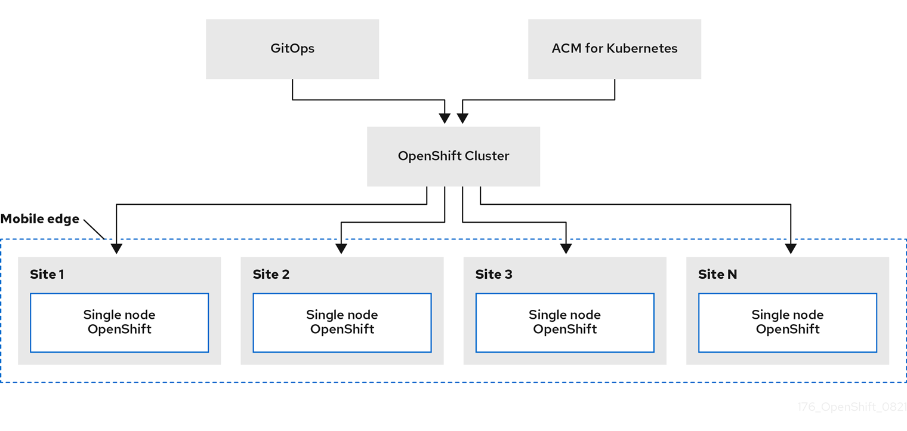

# Zero Touch Provisioning



Zero touch provisioning (ZTP) is a technique that allows to provision new edge sites with declarative configurations of bare-metal  equipment at remote sites. 
Template or overlay configurations install OpenShift Container Platform features that are required for edge workloads.
All configurations are declarative in nature and managed with Red Hat Advanced Cluster Management for Kubernetes (RHACM).

ZTP leverages RHACM and GitOps approach to remotely manage edge sites.
Optimized for Single node OpenShift (SNO) and Three node OpenShift.
For our use-case we implemented a SNO scenario. 

In RHACM, you will need to configure channels that contain URLs and secrets to connect to Git and subscriptions that contain paths, branches or tags that are hosted by Git. The entire configuration will be generated using the power of [kustomize](https://kustomize.io/) that will take care of marging the base teamplates with the proper overlay given a specific site.

The base directory is used as a template and contains all global informations, inside the overlay folder there will be a subfolder for each SNO, containing all the very specific configuration for the site.

# SNO Installation steps
All the following steps are executed automatically via assisted-installer and Red Hat Advanced Cluster Management, so the list is only for explaining purpose and no manual actions are required in order to perform the Single Node OpenShift installation:

1. The assisted installer generate an ISO Image used for discovery
2. Mount of Discovery ISO using redfish API.
3. Boot the host with the Discovery ISO. DNS services are used to resolve the URL exposed by the Assisted Installer (assisted-image-service route) and download the rootfs image.
4. By default, the discovery networking is configured via DHCP.
5. The Agent service on the host starts the discovery and registers to the RHACM Hub. The AgentClusterInstall and ClusterDeployment CRs defines install configs like cluster version and name, networking, encryption, SSH, proxies.
6. The Cluster installation begins. At the end, the ManagedCluster and KlusterletAddonConfig CRs trigger the registration of the cluster to RHACM.

# Prerequisites

1. Needed hardware redfish api enabled at remote location.
2. At least one Cluster Hub for management (RHACM as single pane of glass)
3. Network infrastructure (DNS, DHCP, NTP), network firewall rule for connectivity
4. One or more GIT repos which contains manifests for:
    - Day-1 ZTP deployment (Site Config CRs)
    - Day-2 Infrastructural Configuration (Governance Policies)
    - Application related manifests (using RHACM Application Subscriptions or RH GitOps).
5. A vault used just for keeping External Secret Operator secrets (only if you want to manage secrets with the External Secret Operator).

# Git Structure

The git structure for SNO provisioning is divided into base and overlays, in this way we can take the best out of the kustomize tool, avoiding duplication of common informations, following an example:

# Installing RHACM

1. Install Operator

```yaml
---
apiVersion: v1
kind: Namespace
metadata:
  name: open-cluster-management
---
apiVersion: operators.coreos.com/v1
kind: OperatorGroup
metadata:
  name: open-cluster-management
  namespace: open-cluster-management
spec:
  targetNamespaces:
  - open-cluster-management  
---
apiVersion: operators.coreos.com/v1alpha1
kind: Subscription
metadata:
  name: advanced-cluster-management
  namespace: open-cluster-management
spec:
  channel: release-2.7
  installPlanApproval: Automatic
  name: advanced-cluster-management
  source: redhat-operators
  sourceNamespace: openshift-marketplace
---
apiVersion: operator.open-cluster-management.io/v1
kind: MultiClusterHub
metadata:
  name: multiclusterhub
  namespace: open-cluster-management
spec: {}
```

2. Proceed to define the AgentServiceConfig resource and the Metal3 provisioning server. To do this, just use the code reported below:

```yaml
---
apiVersion: agent-install.openshift.io/v1beta1
kind: AgentServiceConfig
metadata:
  name: agent
spec:
  databaseStorage:
    accessModes:
    - ReadWriteOnce
    resources:
      requests:
        storage: <db_volume_size> # For Example: 10Gi
  filesystemStorage:
    accessModes:
    - ReadWriteOnce
    resources:
      requests:
        storage: <fs_volume_size> # For Example: 100Gi
  imageStorage:
    accessModes:
    - ReadWriteOnce
    resources:
      requests:
        storage: <image_volume_size>  # For Example: 50Gi
```

3. Proceed with the configuration of the Metal3 provisioning server resource:

```yaml
apiVersion: metal3.io/v1alpha1
kind: Provisioning
metadata:
  name: metal3-provisioning
spec:
  provisioningNetwork: Disabled # [ Managed | Unmanaged | Disabled ]
  virtualMediaViaExternalNetwork: true
  watchAllNamespaces: true
```

4. RHACM RBAC

```bash
oc adm policy add-cluster-role-to-user --rolebinding-name=open-cluster-management:subscription-admin open-cluster-management:subscription-admin kube:admin

oc adm policy add-cluster-role-to-user --rolebinding-name=open-cluster-management:subscription-admin open-cluster-management:subscription-admin system:admin
```


## our use-case


```bash
ztp/
├── README.md
├── environments
│   ├── base
│   │   ├── 00-namespace.yaml
│   │   ├── 01-bmh.yaml
│   │   ├── 02-pull-secret.yaml
│   │   ├── 03-agentclusterinstall.yaml
│   │   ├── 04-clusterdeployment.yaml
│   │   ├── 05-klusterletaddonconfig.yaml
│   │   ├── 06-managedcluster.yaml
│   │   ├── 07-infraenv.yaml
│   │   └── kustomization.yaml
│   └── overlays
│       ├── sno1
│       │   ├── 00-namespace.yaml
│       │   ├── 01-bmh.yaml
│       │   ├── 02-pull-secret.yaml
│       │   ├── 03-agentclusterinstall.yaml
│       │   ├── 04-clusterdeployment.yaml
│       │   ├── 05-klusterletaddonconfig.yaml
│       │   ├── 06-managedcluster.yaml
│       │   ├── 07-infraenv.yaml
│       │   └── kustomization.yaml
│       └── sno2
│           ├── 00-namespace.yaml
│           ├── 01-bmh.yaml
│           ├── 02-pull-secret.yaml
│           ├── 03-agentclusterinstall.yaml
│           ├── 04-clusterdeployment.yaml
│           ├── 05-klusterletaddonconfig.yaml
│           ├── 06-managedcluster.yaml
│           ├── 07-infraenv.yaml
│           └── kustomization.yaml
└── policies
    ├── policy-htpasswd.yaml
    ├── policy-lvms.yaml
    └── policy-registry.yaml
```

## using OpenShift Gitops and SiteConfig CRD


```bash
siteconfig
├── environments
|   ├── site1-sno-du.yaml
|   ├── site2-standard-du.yaml
|   └── extra-manifest
|       └── 01-example-machine-config.yaml
└── policies
    ├── policy-htpasswd.yaml
    ├── policy-lvms.yaml
    └── policy-registry.yaml    
```
# Manifest

In our case, in order to speed up the provisioning of the SNO, being this one just a poc, we did not install OpenShift GitOps and therefore we could not use a single 'SiteConfig' manifest, following an example:

```yaml
apiVersion: ran.openshift.io/v1
kind: SiteConfig
metadata:
  name: "<site_name>"
  namespace: "<site_name>"
spec:
  baseDomain: "example.com"
  pullSecretRef:
    name: "assisted-deployment-pull-secret" 
  clusterImageSetNameRef: "openshift-4.10" 
  sshPublicKey: "ssh-rsa AAAA..." 
  clusters:
  - clusterName: "<site_name>"
    networkType: "OVNKubernetes"
    clusterLabels: 
      common: true
      group-du-sno: ""
      sites : "<site_name>"
    clusterNetwork:
      - cidr: 1001:1::/48
        hostPrefix: 64
    machineNetwork:
      - cidr: 1111:2222:3333:4444::/64
    serviceNetwork:
      - 1001:2::/112
    additionalNTPSources:
      - 1111:2222:3333:4444::2
    #crTemplates:
    #  KlusterletAddonConfig: "KlusterletAddonConfigOverride.yaml" 
    nodes:
      - hostName: "example-node.example.com" 
        role: "master"
        #biosConfigRef:
        #  filePath: "example-hw.profile" 
        bmcAddress: idrac-virtualmedia://<out_of_band_ip>/<system_id>/ 
        bmcCredentialsName:
          name: "bmh-secret" 
        bootMACAddress: "AA:BB:CC:DD:EE:11"
        bootMode: "UEFI" 
        rootDeviceHints:
          wwn: "0x11111000000asd123"
        cpuset: "0-1,52-53"
        nodeNetwork: 
          interfaces:
            - name: eno1
              macAddress: "AA:BB:CC:DD:EE:11"
          config:
            interfaces:
              - name: eno1
                type: ethernet
                state: up
                ipv4:
                  enabled: false
                ipv6: 
                  enabled: true
                  address:
                  - ip: 1111:2222:3333:4444::aaaa:1
                    prefix-length: 64
            dns-resolver:
              config:
                search:
                - example.com
                server:
                - 1111:2222:3333:4444::2
            routes:
              config:
              - destination: ::/0
                next-hop-interface: eno1
                next-hop-address: 1111:2222:3333:4444::1
                table-id: 254
```

SiteConfig is a CRD that makes cluster deployment easier by generating the following CRs based on a SiteConfig CR instance;

- AgentClusterInstall
- ClusterDeployment
- NMStateConfig
- KlusterletAddonConfig
- ManagedCluster
- InfraEnv
- BareMetalHost
- HostFirmwareSettings
- ConfigMap for extra-manifest configurations

We have therefore created these individual files in our GIT as described below:

```yaml
---
apiVersion: v1
kind: Namespace
metadata:
  annotations:
    apps.open-cluster-management.io/do-not-delete: 'true'  
  labels:
    kubernetes.io/metadata.name: sno1
  name: sno1
---
apiVersion: v1
data:
  password: XXXXXXXXXXXXX
  username: XXXXXXXXXXXXX
kind: Secret
metadata:
  name: bmc-credentials
  namespace: sno1
  annotations:
    apps.open-cluster-management.io/do-not-delete: 'true'  
type: Opaque
---
apiVersion: metal3.io/v1alpha1
kind: BareMetalHost
metadata:
  annotations:
    bmac.agent-install.openshift.io/hostname: sno1
    inspect.metal3.io: disabled
    apps.open-cluster-management.io/do-not-delete: 'true'
  annotations:
    apps.open-cluster-management.io/do-not-delete: 'true'  
  labels:
    infraenvs.agent-install.openshift.io: sno1
    cluster-name: sno1
  name: sno1
  namespace: sno1
spec:
  automatedCleaningMode: disabled
  online: true
  bmc:
    disableCertificateVerification: true
    address: redfish-virtualmedia+https://example.com/redfish/v1/Systems/1/
    credentialsName: bmc-credentials
  bootMACAddress: 5c:ed:8c:9e:23:1c
  #rootDeviceHints:
  #  hctl: 0:0:0:0
---
apiVersion: v1
data:
  .dockerconfigjson: XXXXXXXXXXX
kind: Secret
metadata:
  annotations:
    apps.open-cluster-management.io/do-not-delete: 'true'  
  name: pull-secret
  namespace: sno1
type: kubernetes.io/dockerconfigjson
---
apiVersion: extensions.hive.openshift.io/v1beta1
kind: AgentClusterInstall
metadata:
  name: sno1
  namespace: sno1
  annotations:
    apps.open-cluster-management.io/do-not-delete: 'true'  
    agent-install.openshift.io/install-config-overrides: '{"networking":{"networkType":"OVNKubernetes"}}'    
spec:
  clusterDeploymentRef:
    name: sno1
  imageSetRef:
    name: img4.12.14-x86-64-appsub
  networking:
    clusterNetwork:
    - cidr: 100.64.0.0/15
      hostPrefix: 23
    serviceNetwork:
    - 100.66.0.0/16
    userManagedNetworking: true  
    machineNetwork:
    - cidr: 10.17.0.0/28
  provisionRequirements:
    controlPlaneAgents: 1    
  sshPublicKey: ssh-rsa XXXXXXXXXXXXXXXXXXXXXXXXXXXXXXXXXXXXXXXXXXXXXXXXXXXXXXX
---
apiVersion: hive.openshift.io/v1
kind: ClusterDeployment
metadata:
  name: sno1
  namespace: sno1
  annotations:
    apps.open-cluster-management.io/do-not-delete: 'true'  
spec:
  baseDomain: example.com
  clusterInstallRef:
    group: extensions.hive.openshift.io
    kind: AgentClusterInstall
    version: v1beta1
    name: sno1
  controlPlaneConfig:
    servingCertificates: {}    
  clusterName: sno1
  platform:
    agentBareMetal:
      agentSelector:
        matchLabels:
          cluster-name: sno1
  pullSecretRef:
    name: pull-secret
---
apiVersion: agent.open-cluster-management.io/v1
kind: KlusterletAddonConfig
metadata:
  annotations:
    apps.open-cluster-management.io/do-not-delete: 'true'
  name: sno1
  namespace: sno1
spec:
  clusterName: 
  clusterNamespace: 
  clusterLabels:
    cloud: hybrid
  applicationManager:
    enabled: true
  policyController:
    enabled: true
  searchCollector:
    enabled: true
  certPolicyController:
    enabled: true
  iamPolicyController:
    enabled: true
---
apiVersion: cluster.open-cluster-management.io/v1
kind: ManagedCluster
metadata:
  annotations:
    apps.open-cluster-management.io/do-not-delete: 'true'
    apps.open-cluster-management.io/reconcile-option: replace
  labels:
    name: sno1
    cluster-name: sno1
    base-domain: example.com
  name: sno1
spec:
  hubAcceptsClient: true
  leaseDurationSeconds: 120  
---
apiVersion: agent-install.openshift.io/v1beta1
kind: InfraEnv
metadata:
  annotations:
    apps.open-cluster-management.io/do-not-delete: 'true'  
  labels:
    agentclusterinstalls.extensions.hive.openshift.io/location: sno1
    networkType: dhcp
  name: sno1
  namespace: sno1
spec:
  clusterRef:
    name: sno1
    namespace: sno1
  agentLabels:
    agentclusterinstalls.extensions.hive.openshift.io/location: sno1
  cpuArchitecture: x86_64
  ipxeScriptType: DiscoveryImageAlways
  pullSecretRef:
    name: pull-secret      
  sshAuthorizedKey: ssh-rsa XXXXXXXXXXXXXXXXXXXXXXXXXXXXXXXXXXXXXXXXXXXXXXXXXX
```

In case you need to enter custom configurations at day-1, you can provide them as ConfigMap to the AgentClusterInstall, for example: 

```yaml
---
apiVersion: extensions.hive.openshift.io/v1beta1
kind: AgentClusterInstall
metadata:
  name: sno1
  namespace: sno1
spec:
  manifestsConfigMapRefs:
    - name: sno1-customconfig
---
apiVersion: v1
kind: ConfigMap
metadata:
  name: sno1-customconfig
  namespace: sno1
data:
  htpasswd-authentication.yaml: |
    apiVersion: config.openshift.io/v1
    kind: OAuth
    metadata:
    name: cluster
    spec:
    identityProviders:
        - htpasswd:
            fileData:
            name: htpass-secret
        mappingMethod: claim
        name: HTPasswd
        type: HTPasswd
```
